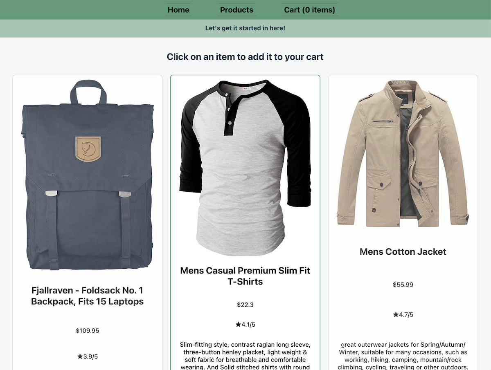

# Sample Shopping Website

## Table of Contents

- [Description](#description)
- [Installation Instructions](#installation-instructions)
- [Usage and Screenshots](#usage-and-screenshots)
- [Technologies Used](#technologies-used)
- [Dependencies and Credits](#dependencies-and-credits)
- [Project Structure](#project-structure)

## Description

This is a shopping website frontend built with Vite and React. It pulls data from a generic test API to populate the store.

## Installation Instructions

1. Clone or fork this repo
2. cd into the project root directory (where the README.md file is located)
3. Run the following in your terminal
    - ``` bash
      npm init -y
      npm install
      ```
1. `npm run dev`
   - `^` + `c` will end the process 
1. Navigate to the url displayed in the terminal: `➜  Local:   http://localhost:5173/` 

## Usage and Screenshots



There is a navigational bar at the top of the page to cycle between the individual tabs. Clicking on an item adds it to your cart.

- [Link to live preview](https://shopping-cart-8jt.pages.dev/)

### Features
- Uses React Router to provide page routing
- Stores cart items in state
- Displays a popup to notify the user that the item has been added

## Technologies Used

### Frontend

- <a href="https://vite.dev/"> Vite </a>
- <a href="https://react.dev/"> React</a>
- <a href="https://developer.mozilla.org/en-US/docs/Web/JavaScript"> JavaScript</a>
- <a href="https://developer.mozilla.org/en-US/docs/Web/HTML"> HTML</a>
- <a href="https://developer.mozilla.org/en-US/docs/Web/CSS"> CSS</a>

### Development Tools

- <a href="https://code.visualstudio.com/"> VS Code</a>
- <a href="https://www.npmjs.com/"> NPM</a>
- <a href="https://git-scm.com/"> Git</a>

### Hosting

- <a href="https://www.cloudflare.com/"> Cloudflare</a>
- <a href="https://github.com/"> Github</a>


## Dependencies and Credits

### Package Dependencies

- [@eslint/js](https://www.npmjs.com/package/@eslint/js)
- [@testing-library/jest-dom](https://www.npmjs.com/package/@testing-library/jest-dom)
- [@testing-library/react](https://www.npmjs.com/package/@testing-library/react)
- [@testing-library/user-event](https://www.npmjs.com/package/@testing-library/user-event)
- [@types/react](https://www.npmjs.com/package/@types/react)
- [@types/react-dom](https://www.npmjs.com/package/@types/react-dom)
- [@vitejs/plugin-react](https://www.npmjs.com/package/@vitejs/plugin-react)
- [eslint](https://www.npmjs.com/package/eslint)
- [eslint-plugin-react](https://www.npmjs.com/package/eslint-plugin-react)
- [eslint-plugin-react-hooks](https://www.npmjs.com/package/eslint-plugin-react-hooks)
- [eslint-plugin-react-refresh](https://www.npmjs.com/package/eslint-plugin-react-refresh)
- [globals](https://www.npmjs.com/package/globals)
- [jsdom](https://www.npmjs.com/package/jsdom)
- [prop-types](https://www.npmjs.com/package/prop-types)
- [react-dom](https://www.npmjs.com/package/react-dom)
- [react-router-dom](https://www.npmjs.com/package/react-router-dom)
- [uuid](https://www.npmjs.com/package/uuid)
- [vitest](https://www.npmjs.com/package/vitest)

### Other Credits

- [Devicion](https://devicon.dev/)
- [Skillicons](https://skillicons.dev/)


## Project Structure

```bash
├──public/                 # Local images are stored here
├──src/
    └── styles/            # Stylesheets are stored here
└──tests/                  # Test files are stored here
```
